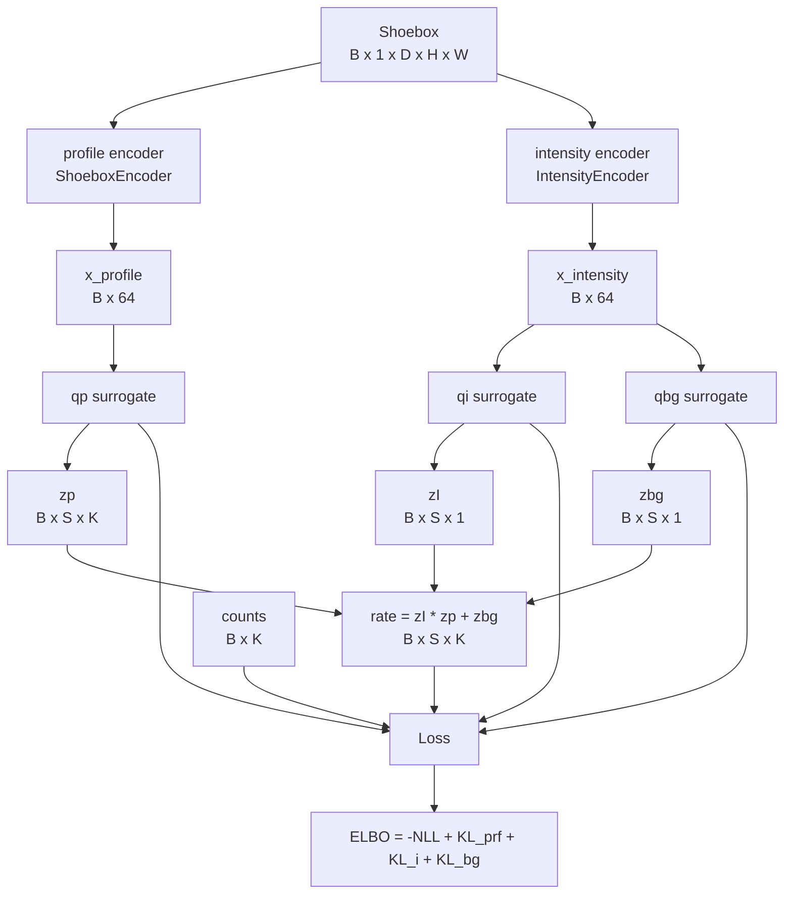
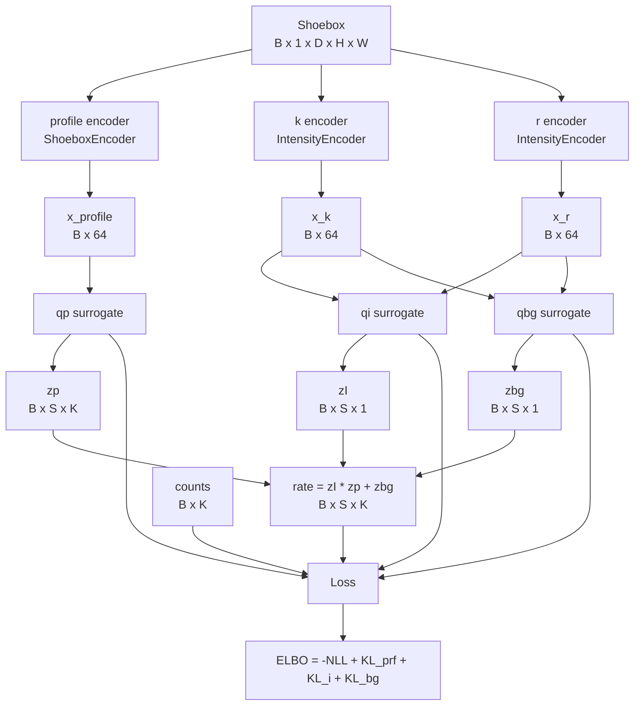
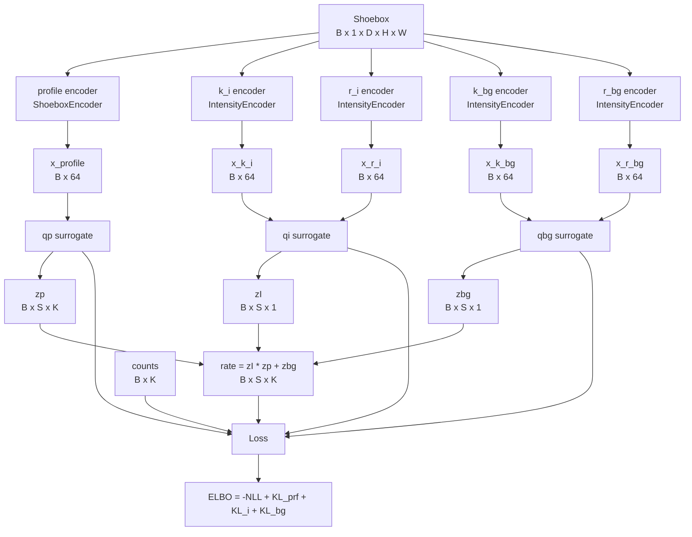
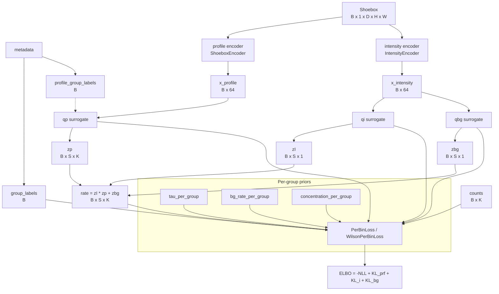
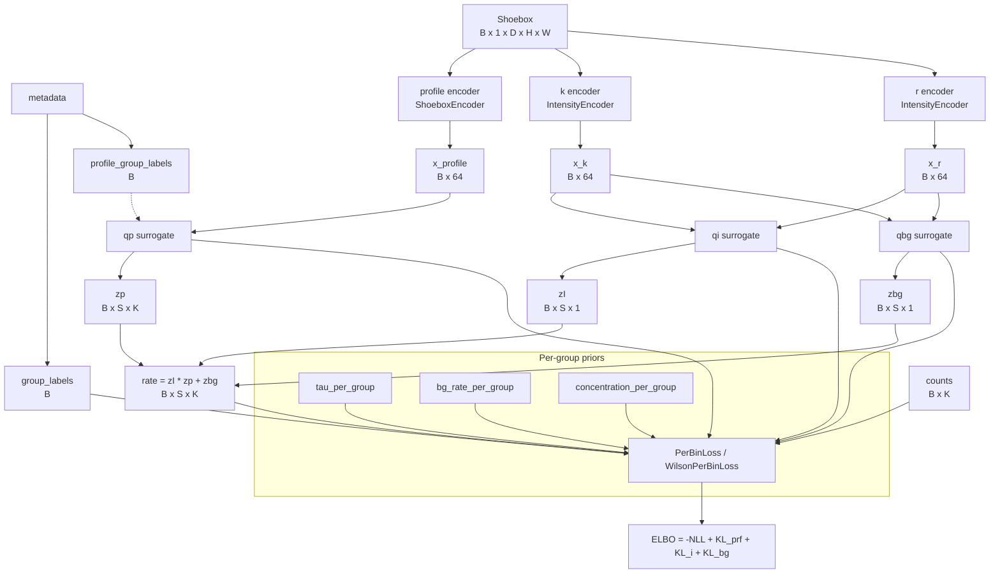
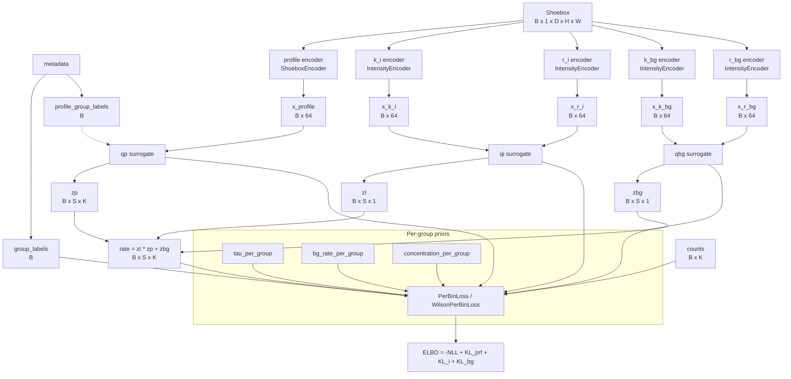

# Integrator Model Dataflows

## IntegratorModelA (2 encoders)



**Key:** qi and qbg share the same encoder output (x_intensity).

---

## IntegratorModelB (3 encoders)



**Key:** qi and qbg each receive (x_k, x_r) as two separate inputs. Surrogates internally combine these to parameterize their distributions.

---

## IntegratorModelC (5 encoders)



**Key:** Full decoupling -- qi gets (x_k_i, x_r_i), qbg gets (x_k_bg, x_r_bg). Prevents entanglement of intensity/background posterior dependencies.

---

## HierarchicalIntegratorA (2 encoders + group labels)



**Key:** Same encoder structure as ModelA, but profile surrogate receives group_labels and loss indexes per-group priors via group_labels.

---

## HierarchicalIntegratorB (3 encoders + group labels)



**Key:** Same encoder structure as ModelB (shared k,r for qi and qbg), plus hierarchical per-group priors.

---

## HierarchicalIntegratorC (5 encoders + group labels)



**Key:** Most flexible model. Fully decoupled intensity/background encoders + hierarchical per-group priors. Profile surrogate can use profile_group_labels (2D: resolution x angle) while loss uses group_labels (1D: resolution only).

---

## Summary

| Model | Encoders | qi/qbg coupling | Hierarchical | Loss types |
|-------|----------|----------------|--------------|------------|
| ModelA | 2 | Shared encoder | No | default |
| ModelB | 3 | Shared (k, r) | No | default |
| ModelC | 5 | Decoupled | No | default |
| HierarchicalA | 2 | Shared encoder | Yes | per_bin, wilson_per_bin |
| HierarchicalB | 3 | Shared (k, r) | Yes | per_bin, wilson_per_bin |
| HierarchicalC | 5 | Decoupled | Yes | per_bin, wilson_per_bin |

### Universal rate equation

```
rate[b, s, k] = zI[b, s, 1] * zp[b, s, k] + zbg[b, s, 1]
```

All models share the same generative model; they differ only in how encoder features are routed to surrogates, and whether per-group priors are used.
