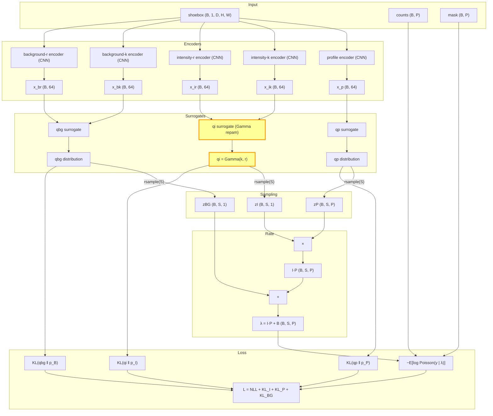
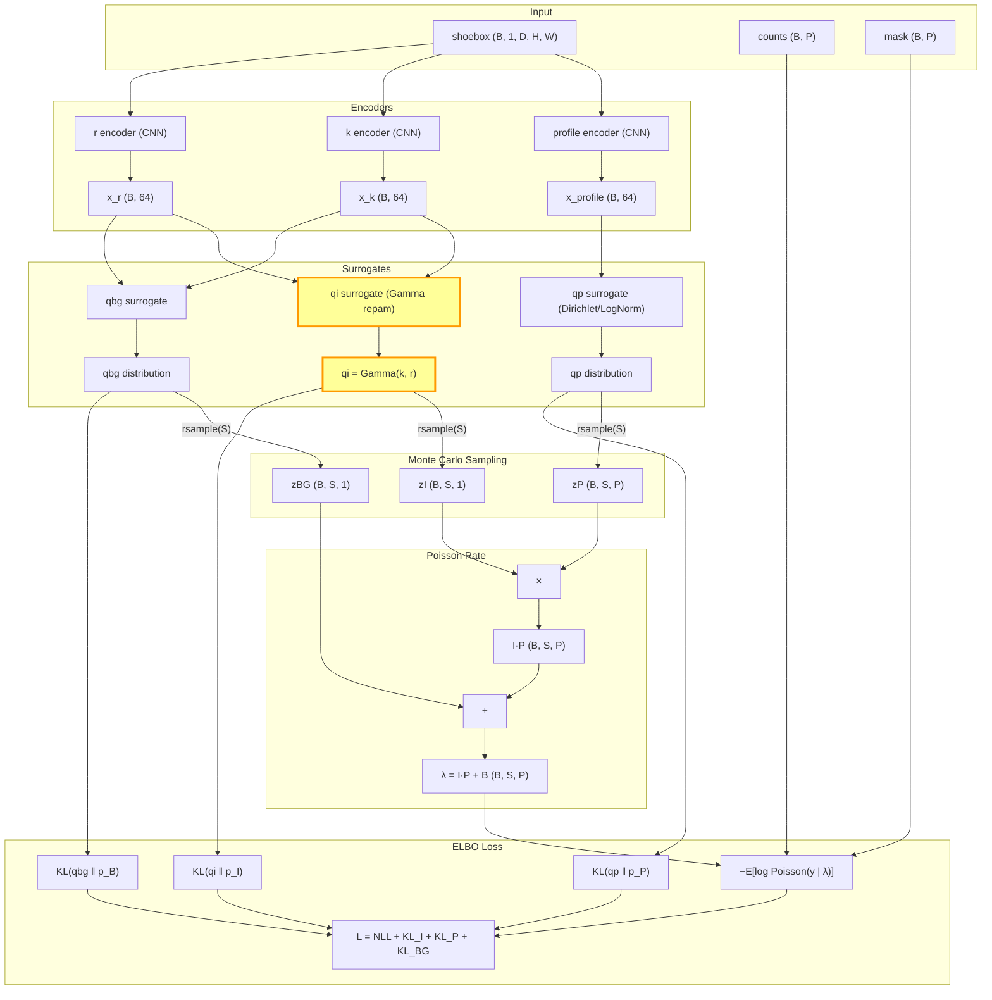
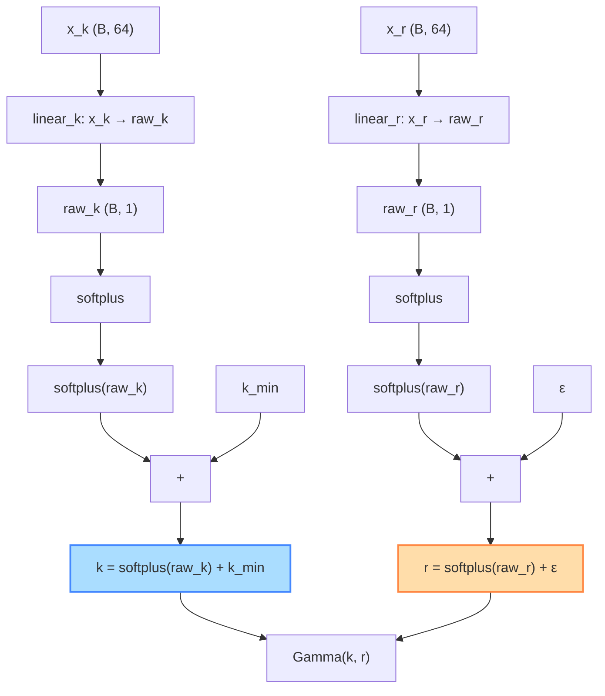
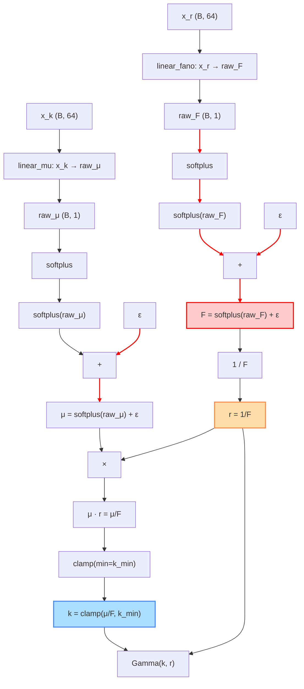
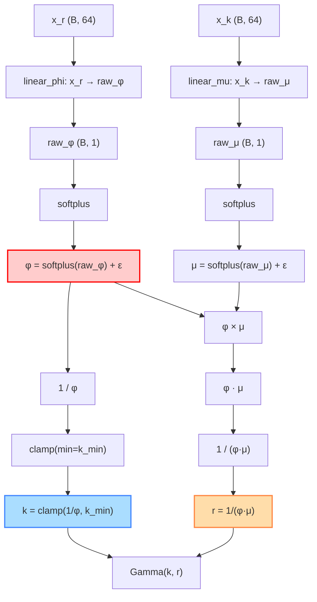
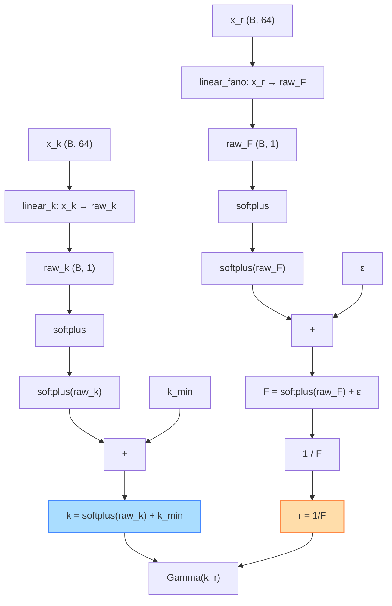
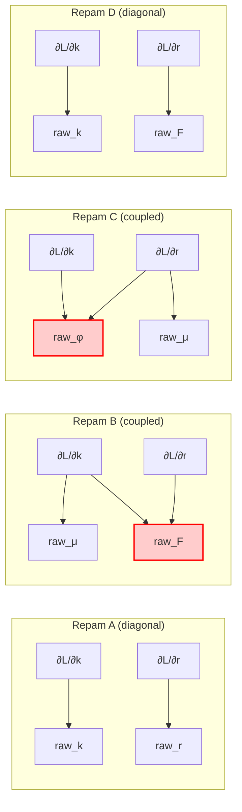

# IntegratorModelB Dataflow Graphs

## Full Model (shared across all Gamma repams)

The outer dataflow is identical for all reparameterizations.
Only the `qi surrogate` box (highlighted) changes internally.

---

## qi Surrogate Internals: Repam A

`raw_k` and `raw_r` are independent.
$J_g$ is diagonal — no coupling.

**Jacobian:**

$$J_A = \begin{pmatrix} \sigma'(\text{raw}_k) & 0 \\ 0 & \sigma'(\text{raw}_r) \end{pmatrix}$$

`∂L/∂k` → only `raw_k` → only `x_k`.  `∂L/∂r` → only `raw_r` → only `x_r`.

---

## qi Surrogate Internals: Repam B

`raw_μ` feeds into `k` via `k = μ/F`.
`raw_F` feeds into **both** `k` and `r`.
$J_g$ is upper-triangular — gradient competition in `raw_F`.

**Jacobian:**

$$J_B = \begin{pmatrix} \sigma'/F & -\mu\sigma'/F^2 \\ 0 & -\sigma'/F^2 \end{pmatrix}$$

`∂L/∂k` → flows to **both** `raw_μ` AND `raw_F`.
`∂L/∂r` → flows to `raw_F`.
**`raw_F` receives competing signals from ∂L/∂k and ∂L/∂r.**

---

## qi Surrogate Internals: Repam C

`raw_φ` feeds into **both** `k` and `r`.
`raw_μ` feeds only into `r`.
$J_g$ has off-diagonal coupling.

**Jacobian:**

$$J_C = \begin{pmatrix} 0 & -\sigma'/\phi^2 \\ -\sigma'/(\phi\mu^2) & -\sigma'/(\phi^2\mu) \end{pmatrix}$$

`∂L/∂k` → flows only to `raw_φ`.
`∂L/∂r` → flows to **both** `raw_μ` AND `raw_φ`.
**`raw_φ` receives competing signals from ∂L/∂k and ∂L/∂r.**

---

## qi Surrogate Internals: Repam D

`raw_k` and `raw_F` are independent.
$J_g$ is diagonal — no coupling, cleanest gradient path.

**Jacobian:**

$$J_D = \begin{pmatrix} \sigma'(\text{raw}_k) & 0 \\ 0 & -\sigma'/F^2 \end{pmatrix}$$

`∂L/∂k` → only `raw_k` → only `x_k`.  `∂L/∂r` → only `raw_F` → only `x_r`.

---

## Side-by-Side Gradient Flow Comparison

The key difference is **where the gradient paths merge**:

**Red nodes** receive competing gradient signals from both `∂L/∂k` and `∂L/∂r`.
This is the structural cause of gradient competition in Repams B and C.
