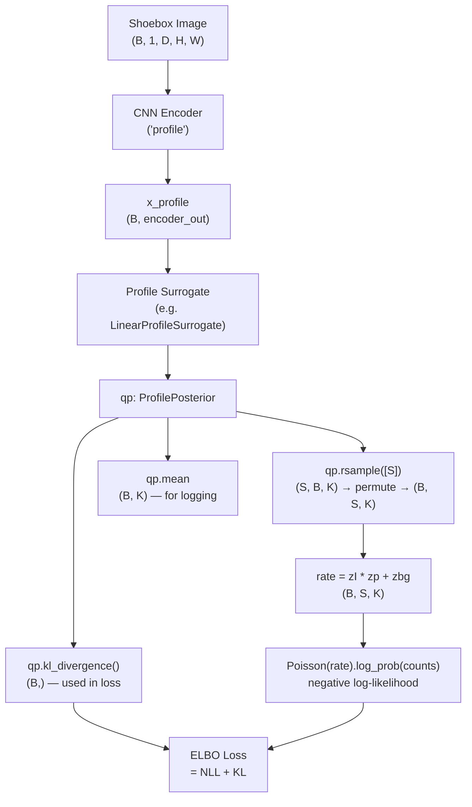
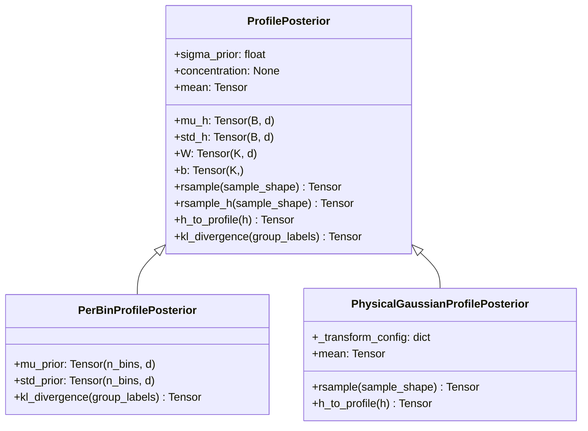
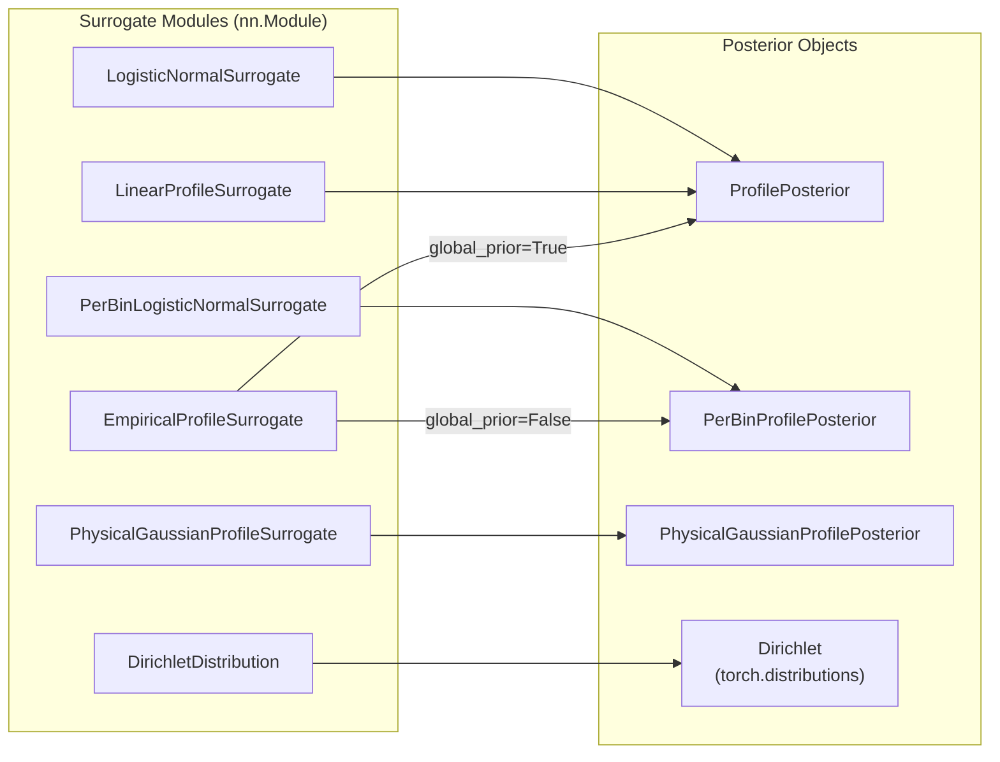
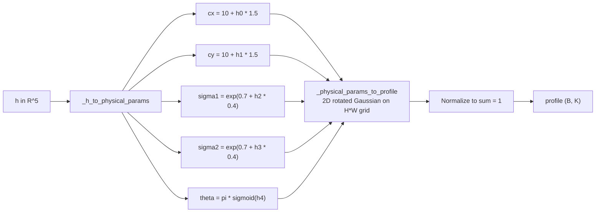
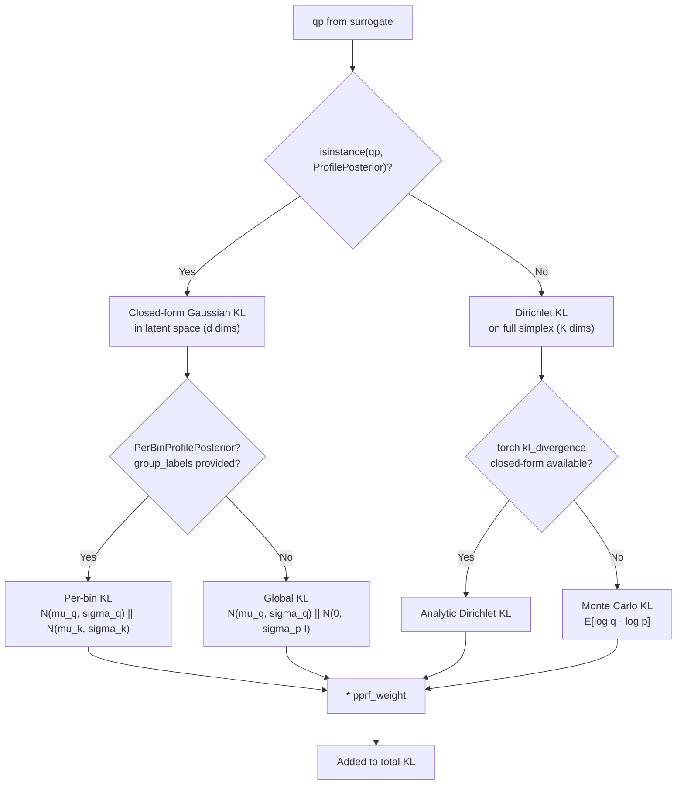
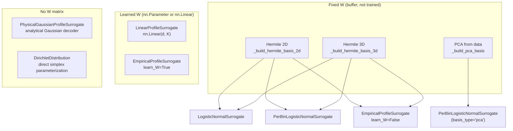

# Profile Models: Implementation Reference

This document explains the profile surrogate models in the integrator codebase. It covers the mathematical formulation, the implementation, and how each component connects to the rest of the pipeline.

## Overview

In the integrator model, each observed shoebox (a small 2D or 3D patch of detector pixels) is modeled as a Poisson process:

```
counts_i ~ Poisson(rate_i)
rate_i   = I * p_i + bg
```

where `I` is the integrated intensity, `p_i` is the profile (normalized shape, summing to 1 over pixels), and `bg` is the background per pixel.

The profile `p` lives on the probability simplex (all entries non-negative, sum to 1). The model learns an approximate posterior `q(p | x)` for each reflection's profile, conditioned on the shoebox image `x` through a CNN encoder. This document covers all the ways `q(p | x)` is parameterized.

## Table of Contents

1. [Pipeline: How Profiles Flow Through the Model](#1-pipeline)
2. [ProfilePosterior (Base Class)](#2-profileposterior)
3. [Surrogates That Produce ProfilePosterior](#3-surrogates)
   - [LogisticNormalSurrogate](#31-logisticnormalsurrogate)
   - [LinearProfileSurrogate](#32-linearprofilesurrogate)
   - [PerBinLogisticNormalSurrogate](#33-perbinlogisticnormalsurrogate)
   - [EmpiricalProfileSurrogate](#34-empiricalprofilesurrogate)
4. [PhysicalGaussianProfileSurrogate](#4-physicalgaussianprofilesurrogate)
5. [DirichletDistribution (Alternative)](#5-dirichletdistribution)
6. [KL Divergence Computation](#6-kl-divergence)
7. [Summary of Differences](#7-summary)
8. [The Decoder Matrix W: Construction and Variants](#8-the-decoder-matrix-w-construction-and-variants)
   - [Hermite Basis (Fixed)](#82-hermite-basis-fixed)
   - [PCA Basis (Fixed, Data-Driven)](#83-pca-basis-fixed-data-driven)
   - [Learned W (nn.Linear)](#84-learned-w-nnlinear)
   - [Optionally Learned W (EmpiricalProfileSurrogate)](#85-optionally-learned-w-empiricalprofilesurrogate)
   - [Per-Bin Empirical Bias (b_per_group)](#86-per-bin-empirical-bias-b_per_group)
   - [Physical Gaussian Decoder (No W)](#87-physical-gaussian-decoder-no-w)
   - [Basis File Contents (.pt files)](#88-basis-file-contents-pt-files)
   - [Config Keys for Basis Generation](#89-config-keys-for-basis-generation)

---

## 1. Pipeline

The profile surrogate is one of three surrogate modules in each integrator model. Here is the full data flow for a single forward pass:



Key dimensions:
- `B` = batch size (number of reflections)
- `S` = number of Monte Carlo samples (`mc_samples`, typically 4)
- `K` = number of profile pixels (`H * W`, typically 441 for 21x21)
- `d` = latent dimensionality (typically 8-14, much smaller than K)

The `qp.rsample([S])` call returns `(S, B, K)` which is permuted to `(B, S, K)` in the integrator's `_forward_impl`. This matches the shape of `zI` (B, S, 1) and `zbg` (B, S, 1) for broadcasting in the rate computation.

---

## 2. ProfilePosterior

**File:** `model/distributions/logistic_normal.py:14`

This is the core data object returned by all latent profile surrogates. It represents:

```
q(h | x) = N(mu_h, diag(std_h^2))        variational posterior in latent space
p(h)     = N(0, sigma_prior^2 * I)        prior in latent space
profile  = softmax(W @ h + b)             deterministic decoder from latent to simplex
```

The idea is to work in a low-dimensional latent space `h in R^d` (d ~ 8-14) instead of directly on the K-dimensional simplex. The decoder `W @ h + b` maps to logits, and softmax projects onto the simplex.



### Constructor

```python
def __init__(self, mu_h, std_h, W, b, sigma_prior):
    self.mu_h = mu_h  # (B, d) -- posterior mean, output of neural net
    self.std_h = (
        std_h  # (B, d) -- posterior std, output of neural net (via softplus)
    )
    self.W = W  # (K, d) -- decoder matrix (Hermite basis or learned)
    self.b = b  # (K,) or (B, K) -- decoder bias (log reference profile)
    self.sigma_prior = sigma_prior  # scalar -- prior std in latent space
    self.concentration = None  # compatibility shim for Dirichlet code paths
```

The `concentration = None` attribute exists because the integrator stores `qp.concentration` in the output dict. For Dirichlet surrogates, this is the Dirichlet concentration vector. For latent surrogates, it's always None.

### rsample

```python
def rsample(self, sample_shape=torch.Size([])):
    eps = torch.randn(*sample_shape, *self.mu_h.shape, device=self.mu_h.device)
    h = self.mu_h + self.std_h * eps  # reparameterization trick
    logits = h @ self.W.T + self.b  # decode to logit space
    return F.softmax(logits, dim=-1)  # project onto simplex
```

Step by step:
1. **Sample noise**: `eps ~ N(0, I)` with shape `(*sample_shape, B, d)`.
2. **Reparameterize**: `h = mu + sigma * eps` gives a sample from `N(mu_h, diag(std_h^2))`. Gradients flow through `mu_h` and `std_h` (this is the "reparameterization trick").
3. **Decode**: `h @ W.T` gives `(*sample_shape, B, K)`. The matrix multiplication maps from d-dimensional latent space to K-dimensional logit space. Adding `b` shifts the logits by the reference profile (in log space).
4. **Softmax**: Converts logits to a valid probability distribution on the simplex.

The output shape is `(*sample_shape, B, K)`. When called as `qp.rsample([S])`, the shape is `(S, B, K)`.

### mean

```python
@property
def mean(self):
    logits = self.mu_h @ self.W.T + self.b
    return F.softmax(logits, dim=-1)
```

This is the profile evaluated at the posterior mean `h = mu_h`. This is NOT the true mean of the logistic-normal distribution (which has no closed form), but is a reasonable point estimate. Shape: `(B, K)`.

### kl_divergence

```python
def kl_divergence(self, group_labels=None):
    sigma_p_sq = self.sigma_prior**2
    sigma_q_sq = self.std_h**2

    kl = 0.5 * (
        sigma_q_sq / sigma_p_sq  # variance ratio
        + self.mu_h**2 / sigma_p_sq  # squared mean / prior variance
        - 1.0  # -1 per dimension
        - torch.log(sigma_q_sq / sigma_p_sq)  # log variance ratio
    ).sum(dim=-1)

    return kl  # (B,)
```

This is the closed-form KL divergence between two diagonal Gaussians:

```
KL(N(mu, diag(sigma^2)) || N(0, sigma_p^2 * I))
= 0.5 * sum_j [ sigma_j^2/sigma_p^2 + mu_j^2/sigma_p^2 - 1 - log(sigma_j^2/sigma_p^2) ]
```

This is computed **in latent space**, not on the simplex. This is a major advantage over Dirichlet: the KL is cheap (d ~ 10 terms) and well-behaved (typically 15-30 nats), compared to Dirichlet KL on the full simplex (K ~ 441 terms, typically 200-500 nats).

The `group_labels` argument is ignored in the base class (the prior is global). Subclasses override this.

### rsample_h and h_to_profile

```python
def rsample_h(self, sample_shape=torch.Size([])):
    eps = torch.randn(*sample_shape, *self.mu_h.shape, device=self.mu_h.device)
    return self.mu_h + self.std_h * eps


def h_to_profile(self, h):
    logits = h @ self.W.T + self.b
    return F.softmax(logits, dim=-1)
```

These split `rsample` into two steps: sample in latent space, then decode. Useful for analysis or when you need the latent `h` samples directly.

---

## 3. Surrogates That Produce ProfilePosterior

All surrogates below are `nn.Module` subclasses. They take the encoder output `x` (B, encoder_out) and return a `ProfilePosterior` (or subclass).



The shared pattern is:

```python
mu_h = self.mu_head(x)  # Linear(encoder_out, d) -> (B, d)
std_h = F.softplus(
    self.std_head(x)
)  # Linear(encoder_out, d) -> softplus -> (B, d)
return ProfilePosterior(mu_h, std_h, W, b, sigma_prior)
```

The `std_head` is initialized so its output starts near a target value:
```python
nn.init.zeros_(self.std_head.weight)
nn.init.constant_(self.std_head.bias, _softplus_inverse(init_std))
```

With `init_std=0.5`, all reflections start with `std_h ~ 0.5` in every latent dimension. The zero weight initialization means the initial std doesn't depend on the input -- it's a constant that the network learns to modulate.

The helper `_softplus_inverse(x) = log(exp(x) - 1)` inverts softplus so that `softplus(bias) = init_std`.


### 3.1 LogisticNormalSurrogate

**File:** `model/distributions/logistic_normal.py:119`

The simplest latent surrogate. Loads a **fixed** basis from a `.pt` file.

```python
def __init__(self, input_dim, basis_path, init_std=0.5):
    basis = torch.load(basis_path)
    self.register_buffer("W", basis["W"])  # (K, d) fixed decoder
    self.register_buffer("b", basis["b"])  # (K,) fixed bias
    self.d = int(basis["d"])  # latent dim
    self.sigma_prior = float(basis.get("sigma_prior", 3.0))

    self.mu_head = nn.Linear(input_dim, self.d)
    self.std_head = nn.Linear(input_dim, self.d)
    # ... init std_head bias
```

**Key properties:**
- `W` and `b` are **frozen buffers** (not trainable). They come from a pre-computed basis (e.g., Hermite functions fitted to reference profiles).
- `b` is typically `log(mean_profile)` -- the log of the average profile across all reflections. This means at `h = 0`, the profile reproduces the global average.
- The model only learns per-reflection deviations from this average via `mu_h` and `std_h`.
- Single global prior `N(0, sigma_prior^2 * I)`.


### 3.2 LinearProfileSurrogate

**File:** `model/distributions/logistic_normal.py:164`

Like LogisticNormalSurrogate but with a **learned** decoder.

```python
def __init__(
    self,
    input_dim,
    latent_dim=8,
    output_dim=441,
    sigma_prior=3.0,
    init_std=0.5,
):
    self.mu_head = nn.Linear(input_dim, latent_dim)
    self.std_head = nn.Linear(input_dim, latent_dim)
    self.decoder = nn.Linear(latent_dim, output_dim)  # <-- learned W, b
    # ... init std_head bias
```

```python
def forward(self, x):
    mu_h = self.mu_head(x)
    std_h = F.softplus(self.std_head(x))
    return ProfilePosterior(
        mu_h=mu_h,
        std_h=std_h,
        W=self.decoder.weight,  # (output_dim, latent_dim) -- trainable
        b=self.decoder.bias,  # (output_dim,) -- trainable
        sigma_prior=self.sigma_prior,
    )
```

**Key differences from LogisticNormalSurrogate:**
- `W` and `b` are `nn.Linear` parameters (trainable), not frozen buffers.
- No basis file needed -- the decoder is learned from scratch.
- `output_dim` and `latent_dim` are constructor arguments instead of being read from a file.
- Single global prior `N(0, sigma_prior^2 * I)`.

**Trade-off:** More flexible (the decoder adapts to the data), but the basis has no physical or analytical grounding. The Hermite basis in LogisticNormalSurrogate provides a structured inductive bias.


### 3.3 PerBinLogisticNormalSurrogate

**File:** `model/distributions/logistic_normal.py:445`

Extends LogisticNormalSurrogate with **per-bin priors** in latent space.

```python
def __init__(self, input_dim, basis_path, init_std=0.5):
    basis = torch.load(basis_path)
    self.register_buffer("W", basis["W"])  # (K, d)
    self.register_buffer("b", basis["b"])  # (K,)
    self.register_buffer("mu_per_group", basis["mu_per_group"])  # (n_bins, d)
    self.register_buffer(
        "std_per_group", basis["std_per_group"]
    )  # (n_bins, d)
    self.d = int(basis["d"])
    self.sigma_prior = float(basis.get("sigma_prior", 3.0))
    # ... heads and init
```

Returns a `PerBinProfilePosterior` instead of `ProfilePosterior`:

```python
def forward(self, x, group_labels=None):
    mu_h = self.mu_head(x)
    std_h = F.softplus(self.std_head(x))
    return PerBinProfilePosterior(
        mu_h=mu_h,
        std_h=std_h,
        W=self.W,
        b=self.b,
        sigma_prior=self.sigma_prior,
        mu_prior=self.mu_per_group,  # <-- per-bin prior means
        std_prior=self.std_per_group,  # <-- per-bin prior stds
    )
```

**Key properties:**
- The decoder (`W`, `b`) is shared across all bins (fixed buffer, same as LogisticNormalSurrogate).
- The **prior** is per-bin: instead of `p(h) = N(0, sigma_p^2 I)`, each resolution/azimuthal bin `k` has `p_k(h) = N(mu_k, diag(sigma_k^2))`.
- The per-bin prior parameters are pre-computed from data (projecting mean bg-subtracted profiles per bin into the latent basis).
- `group_labels` is accepted in `forward()` but is NOT used to select the bias `b` -- it's passed through to `PerBinProfilePosterior` for use in `kl_divergence()`.

**Note:** The `group_labels` argument is present in the `forward()` signature for API consistency with EmpiricalProfileSurrogate, but it does not affect the returned `b`. The PerBinProfilePosterior stores the full `mu_prior` and `std_prior` tables and indexes into them at KL computation time.


### 3.4 EmpiricalProfileSurrogate

**File:** `model/distributions/empirical_profile.py:22`

The most sophisticated variant. Combines **per-bin bias** (decoder) with **per-bin priors** (latent space).

```python
def __init__(
    self,
    input_dim,
    basis_path,
    learn_W=False,
    global_prior=False,
    init_std=0.5,
):
    basis = torch.load(basis_path)

    # Decoder: optionally learnable
    if learn_W:
        self.W = nn.Parameter(basis["W"].clone())  # (K, d) trainable
    else:
        self.register_buffer("W", basis["W"])  # (K, d) frozen

    self.register_buffer("b_per_group", basis["b_per_group"])  # (n_bins, K)
    self.register_buffer("mu_per_group", basis["mu_per_group"])  # (n_bins, d)
    self.register_buffer(
        "std_per_group", basis["std_per_group"]
    )  # (n_bins, d)
    # ... heads and init
```

The critical difference is `b_per_group` with shape `(n_bins, K)` -- a different bias vector for each resolution/azimuthal bin. The bias is `log(mean_profile_in_bin_k)`, so at `h = 0`, the profile reproduces the empirical average for that specific bin.

```python
def forward(self, x, group_labels=None):
    mu_h = self.mu_head(x)
    std_h = F.softplus(self.std_head(x))

    # Select per-bin bias
    if group_labels is not None:
        b = self.b_per_group[group_labels.long()]  # (B, K)
    else:
        b = self.b_per_group.mean(dim=0)  # (K,) fallback

    if self.global_prior:
        return ProfilePosterior(
            mu_h, std_h, W=self.W, b=b, sigma_prior=self.sigma_prior
        )

    return PerBinProfilePosterior(
        mu_h,
        std_h,
        W=self.W,
        b=b,
        sigma_prior=self.sigma_prior,
        mu_prior=self.mu_per_group,
        std_prior=self.std_per_group,
    )
```

**Key differences from PerBinLogisticNormalSurrogate:**
- The **bias `b`** is per-bin (indexed by `group_labels`), not shared.
- `W` can optionally be learned (`learn_W=True`).
- Can fall back to a global prior (`global_prior=True`) returning a plain `ProfilePosterior`.
- When `group_labels` is None, uses the mean bias across all bins as a fallback (e.g., during prediction without bin info).

**This means the decoder itself varies by bin:** the logits are `h @ W.T + b_k`, where `b_k` encodes the empirical average profile shape in bin `k`. The network's `mu_h` only needs to learn per-reflection corrections from this bin-specific reference.

---

## 4. PhysicalGaussianProfileSurrogate

**File:** `model/distributions/logistic_normal.py:332`

A fundamentally different approach: instead of a linear decoder `softmax(W @ h + b)`, the profile is parameterized as a **normalized 2D rotated Gaussian** on the detector grid.



### Latent space

The latent vector `h in R^5` encodes physical parameters:

```python
def _h_to_physical_params(
    h, center_base=10.0, center_scale=1.5, log_sigma_base=0.7, width_scale=0.4
):
    cx = center_base + h[..., 0] * center_scale  # x center
    cy = center_base + h[..., 1] * center_scale  # y center
    sigma1 = exp(
        log_sigma_base + h[..., 2] * width_scale
    )  # width along axis 1
    sigma2 = exp(
        log_sigma_base + h[..., 3] * width_scale
    )  # width along axis 2
    theta = pi * sigmoid(h[..., 4])  # rotation angle [0, pi)
    return cx, cy, sigma1, sigma2, theta
```

Each `h` component maps to a physical quantity with a built-in prior bias:
- **Centers** (`cx`, `cy`): Linearly mapped from `h[0]`, `h[1]`. At `h=0`, the center is at pixel `(10, 10)` (roughly the middle of a 21x21 grid). The `center_scale` controls how far the center can move per unit of `h`.
- **Widths** (`sigma1`, `sigma2`): Exponentially mapped from `h[2]`, `h[3]`. At `h=0`, `sigma = exp(0.7) ~ 2.0` pixels. The exp ensures positivity.
- **Rotation** (`theta`): Sigmoid maps `h[4]` to `[0, 1]`, then scaled by pi to get `[0, pi)`. This parameterization avoids the `theta` vs `theta + pi` ambiguity (a 180-degree rotation of a Gaussian gives the same shape).

### Profile construction

```python
def _physical_params_to_profile(cx, cy, sigma1, sigma2, theta, H=21, W=21):
    yy, xx = torch.meshgrid(arange(H), arange(W), indexing="ij")

    # Rotate coordinates
    cos_t, sin_t = theta.cos(), theta.sin()
    dx = xx - cx
    dy = yy - cy
    x_rot = dx * cos_t + dy * sin_t
    y_rot = -dx * sin_t + dy * cos_t

    # Unnormalized Gaussian
    profile = exp(-0.5 * (x_rot ^ 2 / sigma1 ^ 2 + y_rot ^ 2 / sigma2 ^ 2))

    # Normalize to sum to 1
    profile = profile / profile.sum(dim=(-2, -1), keepdim=True).clamp(
        min=1e-10
    )

    return profile.reshape(..., H * W)
```

This constructs a 2D Gaussian on the pixel grid, rotated by angle `theta`, with independent widths along two axes. The normalization ensures the profile sums to 1 (valid probability distribution).

### PhysicalGaussianProfilePosterior

```python
class PhysicalGaussianProfilePosterior(ProfilePosterior):
    def __init__(self, mu_h, std_h, transform_config, sigma_prior=1.0):
        # Bypasses ProfilePosterior.__init__ (no W, b needed)
        self.mu_h = mu_h
        self.std_h = std_h
        self.sigma_prior = sigma_prior
        self._transform_config = transform_config
        self.concentration = None
```

This inherits from `ProfilePosterior` so that `isinstance(qp, ProfilePosterior)` checks pass in the loss code, but it **bypasses the parent `__init__`** because there is no `W` or `b` matrix. Instead, the decoder is the physical Gaussian construction.

Overridden methods:
- `rsample()`: Samples `h`, then calls `_h_to_profile_physical(h)` instead of `softmax(h @ W.T + b)`.
- `mean`: Evaluates `_h_to_profile_physical(mu_h)`.
- `kl_divergence()`: Inherited from `ProfilePosterior` unchanged -- it's still `KL(N(mu_h, diag(std_h^2)) || N(0, sigma_p^2 I))` in the 5D latent space.

### Surrogate module

```python
class PhysicalGaussianProfileSurrogate(nn.Module):
    def __init__(self, input_dim, basis_path, init_std=0.5):
        config = torch.load(basis_path)
        # Validates basis_type == "physical_gaussian"
        self.d = int(config["d"])  # always 5
        self.sigma_prior = float(config.get("sigma_prior", 1.0))
        self._transform_config = {
            "center_base": ...,
            "center_scale": ...,
            "log_sigma_base": ...,
            "width_scale": ...,
        }
        self.mu_head = nn.Linear(input_dim, self.d)  # -> 5
        self.std_head = nn.Linear(input_dim, self.d)  # -> 5
```

**Key differences from the linear surrogates:**
- Latent dim is always 5 (physically meaningful parameters).
- No decoder matrix -- the decoder is the analytical Gaussian construction.
- `sigma_prior` defaults to 1.0 (not 3.0), reflecting the smaller latent space.
- The transform config scalars (`center_base`, etc.) control the mapping from `h` to physical params.
- Does NOT support per-bin priors (single global prior only).

**Trade-off:** Strong inductive bias (profiles must be unimodal Gaussians). Excellent for monochromatic rotation data where spot profiles are well-approximated by Gaussians. Not suitable for polychromatic/Laue data where profiles can be streaky or multi-modal.

---

## 5. DirichletDistribution (Alternative)

**File:** `model/distributions/dirichlet.py`

The non-latent alternative. Parameterizes `q(p | x)` as a Dirichlet distribution directly on the K-dimensional simplex.

```python
class DirichletDistribution(nn.Module):
    def __init__(self, in_features=64, sbox_shape=(3, 21, 21), eps=1e-6):
        self.n_pixels = prod(sbox_shape)  # K = 1323 or 441
        self.alpha_layer = nn.Linear(
            in_features, self.n_pixels
        )  # -> K concentrations
        self.eps = eps

    def forward(self, x, group_labels=None):
        x = self.alpha_layer(x)
        x = F.softplus(x) + self.eps  # ensure alpha > 0
        return Dirichlet(x)  # torch.distributions.Dirichlet
```

This returns a `torch.distributions.Dirichlet` object, NOT a `ProfilePosterior`. The distinction matters for KL computation (see Section 6).

**Key properties:**
- The network directly outputs K concentration parameters (one per pixel).
- `softplus + eps` ensures all concentrations are positive.
- `rsample()`, `mean`, `log_prob()` are all provided by `torch.distributions.Dirichlet`.
- `group_labels` is accepted but ignored (API consistency).
- No latent space -- the model operates directly in K dimensions.

**Problems with Dirichlet:**
- KL divergence is computed on the full K-dimensional simplex, giving much larger values (200-500 nats vs 15-30 for latent models).
- The KL between two Dirichlets requires Monte Carlo estimation when the prior concentrations don't match the special-case analytical form, making it noisier.
- The concentration prior is hard to set: method-of-moments estimators from data give too-tight priors.

---

## 6. KL Divergence Computation

The loss function needs to compute `KL(q(profile) || p(profile))`. The code path depends on the surrogate type.



### Path A: ProfilePosterior (all latent surrogates)

In `loss.py:202-206`:
```python
if isinstance(qp, ProfilePosterior):
    weight = self.pprf_cfg.weight if self.pprf_cfg is not None else 1.0
    kl_prf = qp.kl_divergence() * weight
```

This calls the closed-form Gaussian KL in latent space. For `PerBinProfilePosterior`, the hierarchical loss passes `group_labels`:

In `kl_helpers.py:26-27`:
```python
if isinstance(qp, ProfilePosterior):
    return qp.kl_divergence(prf_groups) * pprf_weight
```

The `PerBinProfilePosterior.kl_divergence(group_labels)` override selects per-bin prior parameters:

```python
def kl_divergence(self, group_labels=None):
    if group_labels is None:
        return super().kl_divergence()  # fall back to global prior

    mu_p = self.mu_prior[group_labels]  # (B, d)
    std_p = self.std_prior[group_labels]  # (B, d)
    var_q = self.std_h**2
    var_p = std_p**2

    kl = 0.5 * (
        var_q / var_p
        + (self.mu_h - mu_p) ** 2 / var_p
        - 1.0
        - torch.log(var_q / var_p)
    ).sum(dim=-1)
    return kl  # (B,)
```

This is the general KL between two diagonal Gaussians:
```
KL(N(mu_q, diag(sigma_q^2)) || N(mu_p, diag(sigma_p^2)))
= 0.5 * sum_j [ sigma_q_j^2/sigma_p_j^2 + (mu_q_j - mu_p_j)^2/sigma_p_j^2 - 1 - log(sigma_q_j^2/sigma_p_j^2) ]
```

**Important nuance:** This KL is computed in latent space `h`, NOT on the profile simplex. The full KL on the simplex would be `KL(q(p) || p(p))`, which has no closed form for the logistic-normal. The latent KL `KL(q(h) || p(h))` is an upper bound (by the data processing inequality, since `profile = f(h)` is a deterministic transformation). In practice, this is a reasonable and well-behaved surrogate for the true KL.


### Path B: Dirichlet

In `loss.py:207-217`:
```python
elif self.pprf_cfg is not None and self.pprf_params is not None:
    kl_prf = _prior_kl(prior_cfg=self.pprf_cfg, q=qp, params=self.pprf_params, ...)
```

This calls `_kl()` which first tries `torch.distributions.kl.kl_divergence(q, p)` (closed-form if available), then falls back to Monte Carlo:

```python
def _kl(q, p, mc_samples, eps=0.0):
    try:
        return torch.distributions.kl.kl_divergence(q, p)
    except NotImplementedError:
        samples = q.rsample(torch.Size([mc_samples]))
        if eps > 0:
            samples = samples.clamp(min=eps)
        log_q = q.log_prob(samples)
        log_p = p.log_prob(samples)
        return (log_q - log_p).mean(dim=0)
```

For `Dirichlet(alpha_q)` vs `Dirichlet(alpha_p)`, PyTorch does have a closed-form implementation, so this typically doesn't fall back to MC.

In the per-bin loss (`kl_helpers.py`), the Dirichlet prior concentrations are selected per-bin:
```python
alpha = concentration_per_group[prf_groups]  # (B, K)
p_prf = Dirichlet(alpha)
return _kl(qp, p_prf, mc_samples, eps=eps) * pprf_weight
```

---

## 7. Summary of Differences

| Surrogate | Decoder | Latent dim | Prior | `b` (bias) | W trainable |
|---|---|---|---|---|---|
| LogisticNormalSurrogate | `softmax(Wh + b)` | from basis file | Global `N(0, sigma_p^2 I)` | Global, fixed | No (buffer) |
| LinearProfileSurrogate | `softmax(Wh + b)` | configurable (default 8) | Global `N(0, sigma_p^2 I)` | Global, learned | Yes (nn.Linear) |
| PerBinLogisticNormalSurrogate | `softmax(Wh + b)` | from basis file | Per-bin `N(mu_k, diag(sigma_k^2))` | Global, fixed | No (buffer) |
| EmpiricalProfileSurrogate | `softmax(Wh + b_k)` | from basis file | Per-bin or global (configurable) | Per-bin, fixed | Configurable |
| PhysicalGaussianProfileSurrogate | 2D rotated Gaussian | 5 (physical) | Global `N(0, sigma_p^2 I)` | N/A | N/A |
| DirichletDistribution | Direct simplex | K (= n_pixels) | Dirichlet (global or per-bin) | N/A | N/A |

### When to use which

- **LogisticNormalSurrogate**: Good default when you have a pre-computed Hermite basis and want a fixed, interpretable decoder.
- **LinearProfileSurrogate**: When you don't have a pre-computed basis or want the decoder to adapt fully to the data.
- **PerBinLogisticNormalSurrogate**: When profile shapes vary with resolution and you want per-bin priors to regularize the latent space accordingly.
- **EmpiricalProfileSurrogate**: Most informative prior -- each bin gets its own reference profile shape AND latent-space prior. Best for well-characterized datasets where per-bin empirical profiles are available.
- **PhysicalGaussianProfileSurrogate**: Strong inductive bias for monochromatic rotation data. Profiles are guaranteed to be unimodal Gaussians.
- **DirichletDistribution**: Legacy option. High KL values make optimization harder. Kept for polychromatic/Laue data where profile shapes can be irregular (streaky).

---

## 8. The Decoder Matrix W: Construction and Variants

The decoder matrix `W` (shape `(K, d)`) maps from the low-dimensional latent space `h in R^d` to the K-dimensional logit space. Together with the bias `b`, it defines the profile as `softmax(W @ h + b)`. This section explains how `W` and `b` are constructed for each variant.

### 8.1 Overview of W Variants



### 8.2 Hermite Basis (Fixed)

**Files:** `utils/prepare_priors.py` — `_build_hermite_basis_2d` (line 1420), `_build_hermite_basis_3d` (line 1472)

The default and most commonly used W. Constructed analytically from probabilist's Hermite polynomials modulated by a half-Gaussian envelope.

#### Mathematical definition

Each basis function is:

```
phi_{nx,ny}(x, y) = H_nx(x/s) * H_ny(y/s) * exp(-r^2 / (4*s^2))
```

where:
- `H_n` is the probabilist's Hermite polynomial of order `n` (computed via three-term recurrence: `H_0 = 1`, `H_1 = x`, `H_n = x*H_{n-1} - (n-1)*H_{n-2}`)
- `s = sigma_ref` (default 3.0 pixels) is the reference Gaussian width
- `r^2 = ((x - cx)/s)^2 + ((y - cy)/s)^2` where `(cx, cy)` is the grid center `((W-1)/2, (H-1)/2)`
- The half-Gaussian envelope `exp(-r^2/(4s^2))` ensures the basis functions decay at the edges

#### Basis construction (2D case)

```python
def _build_hermite_basis_2d(H=21, W=21, max_order=4, sigma_ref=3.0):
    cy, cx = (H - 1) / 2, (W - 1) / 2
    x_norm = (xx - cx) / sigma_ref  # normalized coordinates
    y_norm = (yy - cy) / sigma_ref

    half_gaussian = exp(-0.25 * (x_norm ^ 2 + y_norm ^ 2))

    # Reference profile for bias b
    full_gaussian = exp(-0.5 * (x_norm ^ 2 + y_norm ^ 2))
    ref = full_gaussian / full_gaussian.sum()
    b = log(ref).reshape(-1)  # (K,) bias vector

    # Build basis functions: all (nx, ny) with nx + ny <= max_order, excluding (0,0)
    for nx in range(max_order + 1):
        for ny in range(max_order + 1 - nx):
            if nx == 0 and ny == 0:
                continue  # (0,0) mode absorbed by b
            phi = H_nx(x_norm) * H_ny(y_norm) * half_gaussian
            phi = phi / phi.norm()  # L2-normalize
            basis_list.append(phi)

    W = stack(basis_list, dim=1)  # (K, d)
```

**Key details:**

- The `(0, 0)` mode is **excluded** from W because it's absorbed into the bias `b`. At `h = 0`, the logits are just `b`, producing `softmax(b) = softmax(log(ref))` — the reference Gaussian profile.
- The constraint `nx + ny <= max_order` (triangular indexing) means `max_order=4` gives `d = 14` basis functions: `(1,0), (0,1), (2,0), (1,1), (0,2), (3,0), (2,1), (1,2), (0,3), (4,0), (3,1), (2,2), (1,3), (0,4)`.
- Each basis function is L2-normalized: `phi = phi / phi.norm()`.
- The bias `b = log(ref_profile)` where `ref_profile` is a normalized Gaussian with `sigma = sigma_ref`. Since `softmax(b) = softmax(log(p)) = p` (softmax of log recovers the original distribution up to a constant), this ensures the zero-latent profile is the reference Gaussian.
- Computation uses float64 for numerical precision, then casts to float32 for the final tensors.

#### 3D extension

For 3D shoeboxes (`D > 1` frames), the basis extends to three dimensions:

```python
phi_{nx,ny,nz}(x, y, z) = H_nx(x/s) * H_ny(y/s) * H_nz(z/sz) * exp(-r3d^2/4)
```

where `sz = sigma_z` (default 1.0) is the frame-direction scale. The frame direction has a separate, smaller max order: `max_order_z = min(1, D-1)`. For `D=3`, this means at most linear variation in the frame direction, which doubles the basis count (each 2D function gets an `nz=0` and `nz=1` variant).

With `max_order=4`, `D=3`: `d = 14 * 2 = 28` basis functions.

#### The bias b

The bias `b` is the log of a reference Gaussian profile centered on the grid:

```python
full_gaussian = exp(-0.5 * (x_norm ^ 2 + y_norm ^ 2))
ref = full_gaussian / full_gaussian.sum()  # normalize to sum=1
b = log(ref.clamp(min=1e-10))  # log-space reference
```

This means:
- At `h = 0`: `profile = softmax(W @ 0 + b) = softmax(b) ≈ ref` (a centered Gaussian)
- Positive `h` components add Hermite deformations to this base shape
- The clamping `min=1e-10` prevents `-inf` in the log for pixels far from center

### 8.3 PCA Basis (Fixed, Data-Driven)

**File:** `utils/prepare_priors.py` — `_build_pca_basis` (line 1534)

An alternative to Hermite that derives the basis from the data itself via SVD.

```python
def _build_pca_basis(signal, d=8, eps=1e-8):
    # Normalize bg-subtracted signal to proportions
    proportions = signal / signal.sum(dim=1, keepdim=True).clamp(min=1)

    # Log-transform
    log_profiles = log(proportions.clamp(min=eps))

    # Center and compute SVD
    b = log_profiles.mean(dim=0)  # (K,) -- mean of log-profiles
    centered = log_profiles - b
    _U, S, Vh = svd(centered, full_matrices=False)

    # Top d components
    W = Vh[:d].T  # (K, d) -- principal directions
```

**Key differences from Hermite:**

| Property | Hermite | PCA |
|----------|---------|-----|
| Basis source | Analytical (Hermite polynomials) | Data-driven (SVD of log-profiles) |
| `b` (bias) | `log(reference_gaussian)` | `mean(log_profiles)` across all reflections |
| `d` (latent dim) | Determined by `max_order` (e.g. 14 for order 4) | User-specified (default 8) |
| Interpretability | Each component has a physical meaning (shift, stretch, etc.) | Components are ordered by variance explained |
| Reproducibility | Deterministic (only depends on grid size + sigma_ref) | Depends on the specific dataset |

The PCA bias `b = mean(log_profiles)` centers the latent space at the average log-profile rather than at a symmetric Gaussian. This is more data-adaptive but less interpretable.

PCA is selected via `profile_basis_type: pca` in the loss config. The default is `hermite`.

### 8.4 Learned W (nn.Linear)

**File:** `model/distributions/logistic_normal.py` — `LinearProfileSurrogate` (line 164)

Instead of a pre-computed fixed basis, `W` and `b` are learned as parameters of an `nn.Linear` layer:

```python
class LinearProfileSurrogate(nn.Module):
    def __init__(
        self, input_dim, latent_dim=8, output_dim=441, sigma_prior=3.0
    ):
        self.decoder = nn.Linear(latent_dim, output_dim)  # W: (K, d), b: (K,)

    def forward(self, x):
        mu_h = self.mu_head(x)
        std_h = F.softplus(self.std_head(x))
        return ProfilePosterior(
            mu_h=mu_h,
            std_h=std_h,
            W=self.decoder.weight,  # (output_dim, latent_dim) -- trainable
            b=self.decoder.bias,  # (output_dim,) -- trainable
            sigma_prior=self.sigma_prior,
        )
```

**Key properties:**
- `W` is `self.decoder.weight` (shape `(output_dim, latent_dim)`) — a trainable `nn.Parameter` initialized by PyTorch's default Kaiming uniform.
- `b` is `self.decoder.bias` — initialized to zero by default.
- No basis file is needed. The latent-to-logit mapping is learned end-to-end.
- `latent_dim` and `output_dim` are constructor arguments, not read from a file.

**Trade-offs:**
- **Pro**: Maximum flexibility — the decoder adapts to whatever profile shapes the data contains.
- **Con**: No inductive bias — the initial profiles (at `h=0`) are `softmax(0 + 0) = uniform`, which is a poor starting point. The model must learn both the "average profile shape" and the "directions of variation" from scratch.
- **Con**: Risk of learning a non-orthogonal or degenerate basis that makes the latent space harder to interpret.

### 8.5 Optionally Learned W (EmpiricalProfileSurrogate)

**File:** `model/distributions/empirical_profile.py` — `EmpiricalProfileSurrogate` (line 22)

This surrogate loads W from a pre-computed Hermite basis file but can optionally make it trainable:

```python
class EmpiricalProfileSurrogate(nn.Module):
    def __init__(self, input_dim, basis_path, learn_W=False, ...):
        basis = torch.load(basis_path)

        if learn_W:
            self.W = nn.Parameter(basis["W"].clone())    # trainable, initialized from Hermite
        else:
            self.register_buffer("W", basis["W"])         # frozen buffer
```

When `learn_W=True`:
- `W` starts as the Hermite basis (good initialization) but is fine-tuned during training
- This combines the inductive bias of the Hermite basis with the flexibility to adapt
- The gradient flows through both the `mu_head`/`std_head` AND through `W`

When `learn_W=False` (default):
- Identical to the fixed Hermite case in `PerBinLogisticNormalSurrogate`
- Only `mu_head` and `std_head` are trained

### 8.6 Per-Bin Empirical Bias (b_per_group)

**File:** `utils/prepare_priors.py` — `_fit_empirical_profile_basis` (line 543)

The most important distinction of `EmpiricalProfileSurrogate` is not about W itself, but about the **bias `b`**. Instead of a single global `b`, it uses a per-bin bias `b_per_group` with shape `(n_bins, K)`.

#### Construction

```python
def _fit_empirical_profile_basis(counts, masks, group_labels, n_bins, ...):
    signal = _bg_subtract_signal(counts, masks, D, H, W)

    # Build shared Hermite W (same as _build_hermite_basis_2d/3d)
    W_basis, b_ref, orders = _build_hermite_basis_2d(H, W, max_order, sigma_ref)

    # Normalize signal to proportions
    proportions = signal / signal.sum(dim=1, keepdim=True).clamp(min=1)

    # Compute per-bin empirical bias
    b_per_group = zeros(n_bins, K)
    for k in range(n_bins):
        mean_k = proportions[group_labels == k].mean(dim=0)

        # Remove noise floor (quantile-based background estimate)
        floor = mean_k.quantile(0.75)
        mean_k = (mean_k - floor).clamp(min=0)

        # Normalize and take log
        mean_k = mean_k / mean_k.sum().clamp(min=1e-10)
        b_per_group[k] = log(mean_k.clamp(min=1e-8))
```

**Step by step:**

1. **Background subtraction**: Same quietest-frame/border method as other priors.
2. **Per-bin mean profile**: Average the normalized signal profiles within each resolution/azimuthal bin.
3. **Noise floor removal**: The 75th quantile of the mean profile is subtracted. Rationale: the signal occupies a small fraction of the shoebox, so most pixels are background. The 75th quantile is a robust estimate of this background level in the mean profile.
4. **Log transform**: `b_k = log(mean_profile_k)` so that `softmax(W @ 0 + b_k) ≈ mean_profile_k`.

This means at `h = 0`, each bin reproduces its own empirical average profile shape rather than a generic symmetric Gaussian.

#### Per-bin latent priors from empirical bias

After computing `b_per_group`, the per-bin latent statistics (`mu_per_group`, `std_per_group`) are computed by projecting reflections using **their bin's own bias**:

```python
# Project using per-bin bias
b_selected = b_per_group[group_labels]  # (N, K) -- each reflection's bin bias
centered = log_profiles - b_selected  # center relative to bin's reference
h_all = centered @ W_basis  # (N, d) -- latent codes

# Per-bin statistics
for k in range(n_bins):
    h_k = h_all[group_labels == k]
    mu_per_group[k] = h_k.mean(dim=0)  # (d,)
    std_per_group[k] = h_k.std(dim=0).clamp(min=0.1)  # (d,)
```

This differs from the standard `_fit_profile_basis_per_bin` where all reflections are centered relative to a single global `b`. Here, each reflection is centered relative to its own bin's empirical mean, producing latent codes that represent **deviations from the bin-specific average**.

#### Optional Gaussian smoothing

When `profile_smooth_sigma > 0`, the per-bin mean profile is spatially smoothed before taking the log:

```python
if smooth_sigma > 0:
    mean_3d = mean_k.reshape(D, H, W)
    mean_3d = _gaussian_smooth_3d(mean_3d, smooth_sigma)
    mean_k = mean_3d.reshape(-1)
```

This uses separable 3D Gaussian convolution (reflected padding) to reduce noise in bins with few reflections. Configured via `profile_smooth_sigma` in the loss args (default: 0, i.e., no smoothing).

### 8.7 Physical Gaussian Decoder (No W)

**File:** `model/distributions/logistic_normal.py` — `PhysicalGaussianProfileSurrogate` (line 332)

This variant has no W matrix at all. The latent `h in R^5` is decoded via an analytical 2D Gaussian construction (see Section 4). The "decoder" is hard-coded physics, not a matrix multiplication.

The basis file (`profile_basis.pt`) contains only scalar hyperparameters:

```python
profile_basis = {
    "basis_type": "physical_gaussian",
    "d": 5,
    "sigma_prior": 1.0,
    "center_base": 10.0,  # center offset at h=0
    "center_scale": 1.5,  # sensitivity of center to h
    "log_sigma_base": 0.7,  # log(width) at h=0
    "width_scale": 0.4,  # sensitivity of width to h
}
```

These scalars are typically generated by the simulation code (`simulate/generate.py`) using the same parameters that generated the simulated profiles.

### 8.8 Basis File Contents (.pt files)

All basis files are PyTorch `.pt` files saved via `torch.save`. Here is a summary of what each variant contains:

#### `profile_basis_per_bin.pt` (for PerBinLogisticNormalSurrogate)

Generated by `_fit_profile_basis_per_bin` in `prepare_priors.py`.

```python
{
    "W": Tensor(K, d),  # Hermite or PCA basis matrix
    "b": Tensor(
        K,
    ),  # log(reference_profile) -- single global bias
    "d": int,  # latent dimensionality
    "mu_per_group": Tensor(n_bins, d),  # per-bin prior mean in latent space
    "std_per_group": Tensor(n_bins, d),  # per-bin prior std in latent space
    "sigma_prior": float,  # global fallback prior std
    "basis_type": str,  # "hermite_per_bin" or "pca_per_bin"
    "orders": list[tuple] | None,  # Hermite orders (nx, ny) or None for PCA
    "explained_var": Tensor
    | None,  # PCA only: variance explained per component
}
```

#### `empirical_profile_basis_per_bin.pt` (for EmpiricalProfileSurrogate)

Generated by `_fit_empirical_profile_basis` in `prepare_priors.py`.

```python
{
    "W": Tensor(K, d),  # Hermite basis matrix (same as above)
    "b_per_group": Tensor(
        n_bins, K
    ),  # per-bin log(mean_profile) -- per-bin bias
    "d": int,  # latent dimensionality
    "mu_per_group": Tensor(
        n_bins, d
    ),  # per-bin prior mean (centered on per-bin bias)
    "std_per_group": Tensor(n_bins, d),  # per-bin prior std
    "sigma_prior": float,  # global fallback prior std
    "basis_type": "empirical_per_bin",
    "orders": list[tuple],  # Hermite orders (nx, ny)
}
```

Key difference: `b_per_group` (n_bins, K) instead of `b` (K,).

#### `profile_basis.pt` (for LogisticNormalSurrogate or PhysicalGaussianProfileSurrogate)

For Hermite/PCA (without per-bin priors):
```python
{
    "W": Tensor(K, d),  # basis matrix
    "b": Tensor(
        K,
    ),  # log(reference_profile)
    "d": int,
    "sigma_prior": float,
}
```

For physical Gaussian:
```python
{
    "basis_type": "physical_gaussian",
    "d": 5,
    "sigma_prior": 1.0,
    "center_base": float,
    "center_scale": float,
    "log_sigma_base": float,
    "width_scale": float,
}
```

### 8.9 Config Keys for Basis Generation

The basis files are auto-generated by `prepare_per_bin_priors()` when they don't exist. The relevant YAML config keys (all under `loss.args`):

| Key | Type | Default | Description |
|-----|------|---------|-------------|
| `profile_basis_per_bin` | str | — | Filename for the per-bin basis file (triggers generation) |
| `empirical_profile_basis_per_bin` | str | — | Filename for the empirical basis file (triggers generation) |
| `profile_basis_type` | str | `"hermite"` | `"hermite"` or `"pca"` |
| `profile_basis_d` | int | `14` | Latent dim (PCA only; Hermite uses max_order) |
| `profile_basis_max_order` | int | `4` | Max Hermite polynomial order |
| `profile_basis_sigma_ref` | float | `3.0` | Reference Gaussian width in pixels |
| `profile_smooth_sigma` | float | `0.0` | Gaussian smoothing sigma for empirical bias |

### 8.10 How W is Used at Runtime

Regardless of how W was constructed, it enters the model the same way:

```python
# In ProfilePosterior.rsample():
logits = h @ self.W.T + self.b  # (*, B, d) @ (d, K) + (K,) -> (*, B, K)
profile = softmax(logits, dim=-1)  # project onto simplex
```

The matrix multiplication `h @ W.T` computes, for each reflection, a weighted combination of basis functions:

```
logits_i = sum_j h_j * W[:, j] + b
         = h_1 * (column_1 of W) + h_2 * (column_2 of W) + ... + b
```

Each column of W is a "direction" in logit space. For Hermite, these directions correspond to interpretable profile deformations (shift, stretch, asymmetry, etc.). For learned W, they're whatever the optimizer finds useful.

The softmax then converts these logits to a valid probability distribution. Since `b = log(ref_profile)`, the logits at `h = 0` are `log(ref)`, and `softmax(log(ref)) = ref / sum(ref) = ref` (the reference profile is already normalized).

### 8.11 Summary: Choosing the Right W

| W Variant | When to Use | Pros | Cons |
|-----------|-------------|------|------|
| **Hermite (fixed)** | Default for most experiments | Interpretable, stable, no data dependence | May not capture unusual profile shapes |
| **PCA (fixed)** | When Hermite is too rigid | Adapts to actual profile shape distribution | Depends on dataset, less interpretable |
| **Learned (nn.Linear)** | Exploratory, no basis file | Maximum flexibility | No inductive bias, poor initialization |
| **Hermite + learn_W** | Fine-tuning a Hermite basis | Best of both: Hermite init + adaptation | More parameters to train |
| **Per-bin empirical bias** | Production runs with enough data | Bin-specific reference shapes | Requires sufficient reflections per bin |
| **Physical Gaussian** | Monochromatic rotation, well-behaved spots | Strongest inductive bias, only 5 params | Cannot model non-Gaussian profiles |

